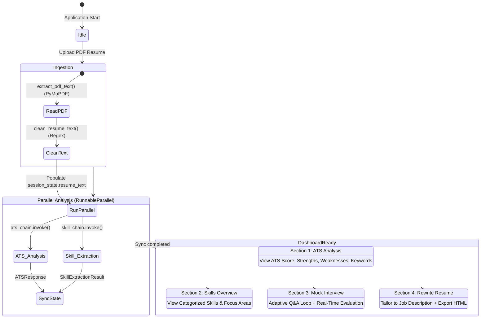
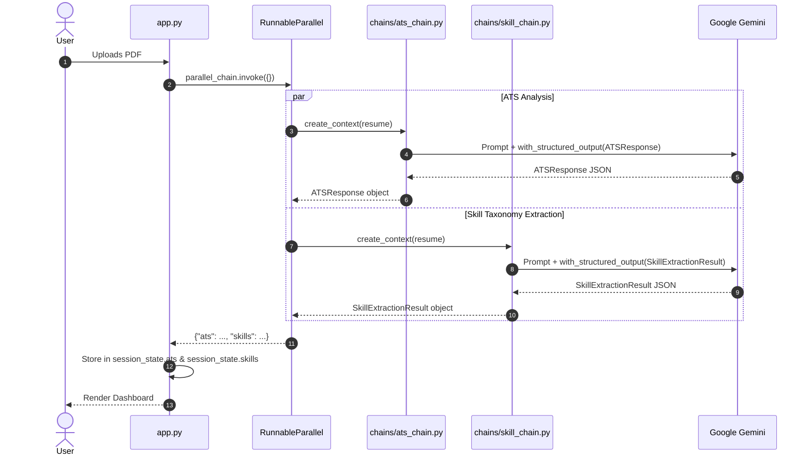
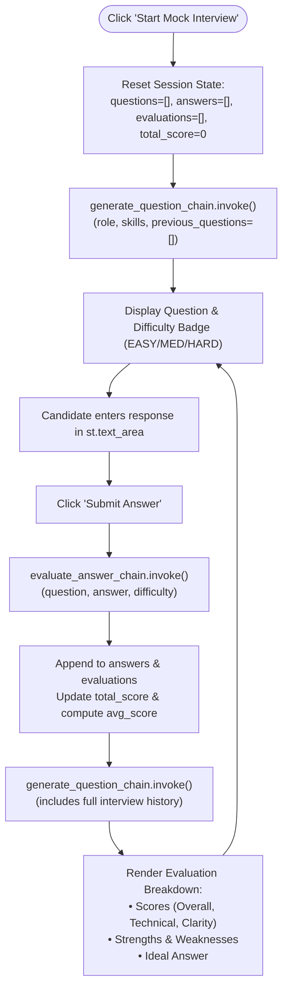
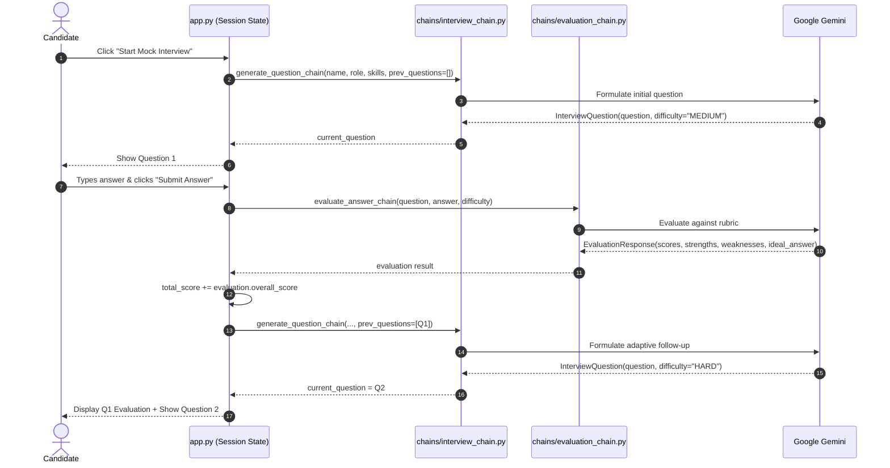
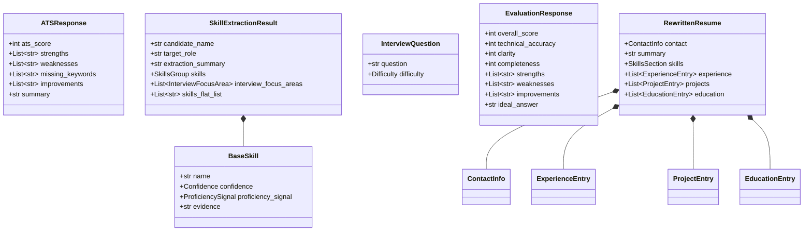
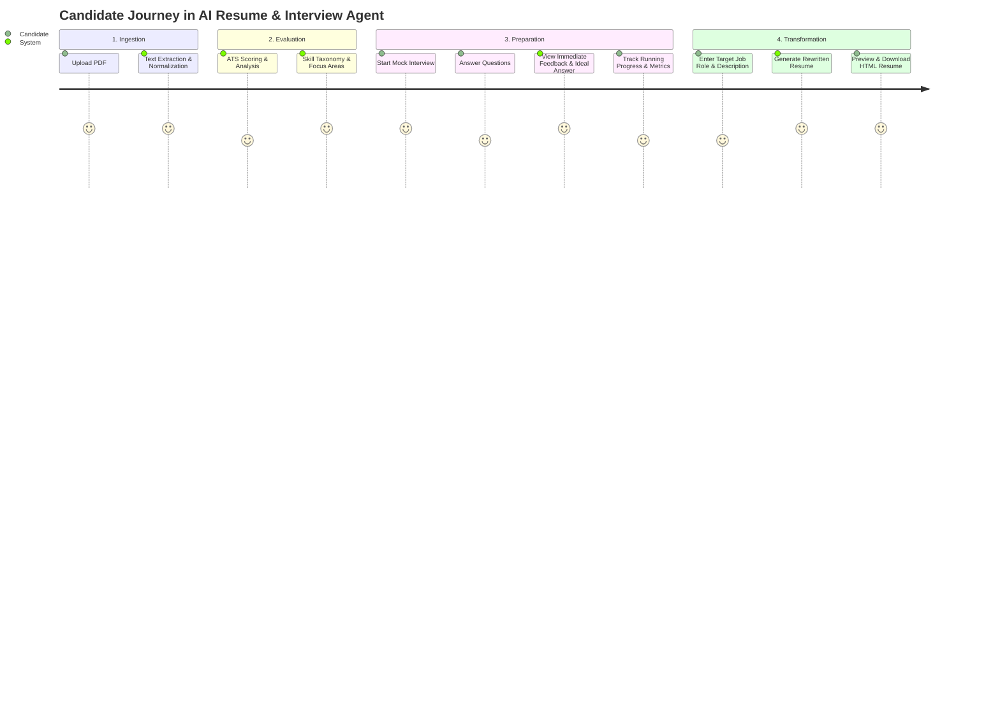

# AI Resume & Interview Agent — System Architecture & Workflow

An end-to-end technical guide explaining the inner workings, data flows, LangChain execution pipelines, session state lifecycle, and component interactions of the **AI Resume & Interview Agent**.

---

## 1. High-Level Architecture Overview

The system is built on a modular pipeline design combining:
- **Presentation Layer**: Streamlit reactive UI with multi-tab section routing and session persistence.
- **Document Processing Layer**: In-memory binary PDF parsing using PyMuPDF (`fitz`) and regex text normalization.
- **LangChain Reasoning Pipeline**: Orchestrated using LangChain Expression Language (LCEL), `RunnableParallel`, and structured outputs (`with_structured_output`) with Pydantic schemas.
- **LLM Layer**: Google Gemini (`gemini-flash-latest` / configurable) powering 100% of reasoning, analysis, mock interviewing, answer evaluations, rewriting, and HTML resume styling.
- **Prompt Management System**: Decoupled markdown prompt repositories loaded dynamically via file readers.

```mermaid
flowchart TD
    subgraph Client["User Interface (Streamlit)"]
        UI_Upload["PDF Upload Widget"]
        UI_Sidebar["Navigation & Sidebar"]
        UI_ATS["Section 1: ATS Analysis"]
        UI_Skills["Section 2: Skills Breakdown"]
        UI_Interview["Section 3: Mock Interview"]
        UI_Rewrite["Section 4: Rewrite & HTML Resume"]
    end

    subgraph Ingestion["Document Ingestion & Preprocessing"]
        PDF["services/pdf_parser.py<br/>(PyMuPDF extract_pdf_text)"]
        Clean["services/resume_extractor.py<br/>(clean_resume_text)"]
    end

    subgraph State["Streamlit Session State Store"]
        SS_Text["st.session_state.resume_text"]
        SS_ATS["st.session_state.ats"]
        SS_Skills["st.session_state.skills"]
        SS_Questions["st.session_state.questions & answers"]
        SS_Eval["st.session_state.evaluations & total_score"]
        SS_Rewritten["st.session_state.rewritten_resume"]
        SS_HTML["st.session_state.html_resume"]
    end

    subgraph Orchestration["LangChain LCEL Execution Chains"]
        ParallelChain["RunnableParallel(ats, skills)"]
        ATSChain["chains/ats_chain.py"]
        SkillChain["chains/skill_chain.py"]
        InterviewChain["chains/interview_chain.py"]
        EvalChain["chains/evaluation_chain.py"]
        RewriteChain["chains/rewrite_chain.py"]
        FormatChain["chains/format_chain.py"]
    end

    subgraph Prompts["Prompt Engine (prompts/)"]
        PR["prompt_reader.py"]
        P_ATS["ats_prompt.md"]
        P_Skills["skills_prompt.md"]
        P_Interview["interview_prompt.md"]
        P_Eval["evaluation_prompt.md"]
        P_Rewrite["rewrite_prompt.md"]
        P_Format["format_prompt.md"]
    end

    subgraph Models["Foundation LLMs"]
        Gemini["Google Gemini (gemini-flash-latest)"]
    end

    %% Wiring
    UI_Upload --> PDF
    PDF --> Clean
    Clean --> SS_Text
    SS_Text --> ParallelChain

    ParallelChain --> ATSChain
    ParallelChain --> SkillChain
    P_ATS --> PR --> ATSChain
    P_Skills --> PR --> SkillChain

    ATSChain --> Gemini
    SkillChain --> Gemini

    ATSChain -.->|ATSResponse| SS_ATS
    SkillChain -.->|SkillExtractionResult| SS_Skills

    SS_ATS --> UI_ATS
    SS_Skills --> UI_Skills

    %% Interview Wiring
    UI_Interview --> InterviewChain
    P_Interview --> PR --> InterviewChain
    InterviewChain --> Gemini
    InterviewChain -.->|InterviewQuestion| SS_Questions

    UI_Interview --> EvalChain
    P_Eval --> PR --> EvalChain
    EvalChain --> Gemini
    EvalChain -.->|EvaluationResponse| SS_Eval
    SS_Eval --> UI_Interview

    %% Rewrite Wiring
    UI_Rewrite --> RewriteChain
    P_Rewrite --> PR --> RewriteChain
    RewriteChain --> Gemini
    RewriteChain -.->|RewrittenResume| SS_Rewritten

    SS_Rewritten --> FormatChain
    P_Format --> PR --> FormatChain
    FormatChain --> Gemini
    FormatChain -.->|Clean HTML| SS_HTML
    SS_HTML --> UI_Rewrite
```



---

## 2. End-to-End System Workflow

The user navigates through 4 sequential stages after uploading their resume:



---

## 3. Deep Dive into Pipeline Components

### 3.1 Document Ingestion (`services/`)
1. **`services/pdf_parser.py`**:
   - Accepts the Streamlit `UploadedFile` buffer in-memory (`uploaded_file.read()`).
   - Uses PyMuPDF's `fitz.open(stream=pdf_bytes, filetype="pdf")`.
   - Iterates through each document page, concatenating extracted text into a unified string.
2. **`services/resume_extractor.py`**:
   - Normalizes excess newlines (`re.sub(r"\n+", "\n", text)`).
   - Collapses multiple whitespace gaps (`re.sub(r"\s+", " ", text)`).

---

### 3.2 Phase 1: Dual Parallel Analysis (`RunnableParallel`)

When a new PDF is detected, `app.py` executes both chains concurrently using LangChain's `RunnableParallel`:

```python
ats_chain = analyze_resume_chain(cleaned_text, llm)
skill_chain = extract_skills_from_resume_chain(cleaned_text, llm)
parallel_chain = RunnableParallel(ats=ats_chain, skills=skill_chain)
result = parallel_chain.invoke({})
```



#### Structured Schemas for Analysis:
- **`ATSResponse`** (`chains/ats_chain.py`):
  - `ats_score` (`int`): 0–100 calculated match score.
  - `strengths` (`List[str]`): High-scoring resume elements.
  - `weaknesses` (`List[str]`): Missing metrics, formatting flags.
  - `missing_keywords` (`List[str]`): Industry standard terms absent from text.
  - `improvements` (`List[str]`): Actionable edits.
  - `summary` (`str`): Executive critique.

- **`SkillExtractionResult`** (`chains/skill_chain.py`):
  - `candidate_name` & `target_role`.
  - Categorized taxonomy:
    - `programming_languages`
    - `frameworks_and_libraries`
    - `databases` (relational, NoSQL, vector, graph, etc.)
    - `cloud_and_devops` (providers, CI/CD, containerization, IaC)
    - `ai_and_ml` (frameworks, model types, MLOps)
    - `tools_and_platforms`, `domains_and_concepts`, `apis_and_protocols`
  - Per-skill metadata: `confidence` (`HIGH`/`MEDIUM`/`LOW`), `proficiency_signal` (`PRIMARY`/`SECONDARY`/`MENTIONED`), and direct textual `evidence`.
  - `interview_focus_areas`: Suggested interview topics with `suggested_depth` (`conceptual`/`practical`/`deep-dive`).

---

### 3.3 Phase 2 & 3: Adaptive Mock Interview & Evaluation Engine

The mock interview functions as an adaptive state machine:





---

### 3.4 Phase 4: Resume Rewriter & HTML Formatter

When target role details are provided, the system transforms the raw resume into an ATS-optimized, styled HTML document:

```mermaid
flowchart LR
    subgraph Inputs
        R["Raw Resume Text"]
        ATS["ATS Weaknesses & Keywords"]
        S["Skills List"]
        JD["Target Job Role & Description"]
    end

    subgraph Rewrite["chains/rewrite_chain.py"]
        RC["rewrite_resume_chain()"]
        Schema["Pydantic Structure:<br/>Contact, Summary, Skills,<br/>Experience, Projects, Education"]
    end

    subgraph Format["chains/format_chain.py"]
        FC["format_resume_chain()"]
        GeminiFormat["Google Gemini<br/>(temperature=0)"]
        HTML["Responsive Clean HTML"]
    end

    subgraph Output["Streamlit UI Preview"]
        Preview["st.components.v1.html()"]
        Download["Download .html button"]
    end

    Inputs --> RC
    RC --> Schema
    Schema --> FC
    FC --> GeminiFormat
    GeminiFormat --> HTML
    HTML --> Preview
    HTML --> Download
```



---

## 4. Pydantic Data Model Hierarchy



---

## 5. Streamlit Session State Management

Streamlit re-runs scripts top-to-bottom on every user interaction. The table below outlines how state is preserved across re-renders:

| Key | Type | Instantiated In | Purpose |
| :--- | :--- | :--- | :--- |
| `resume_text` | `str` | PDF Upload | Cleaned text extracted from the user's resume. |
| `source_file` | `str` | PDF Upload | Tracks filename to trigger re-analysis only on new file uploads. |
| `ats` | `ATSResponse` | `run_analysis()` | Cached ATS critique, score, strengths, and weaknesses. |
| `skills` | `SkillExtractionResult` | `run_analysis()` | Categorized skill taxonomy, candidate info, and interview focus areas. |
| `current_question` | `InterviewQuestion` | Mock Interview | The currently active interview prompt displayed to the candidate. |
| `questions` | `List[InterviewQuestion]`| Mock Interview | Cumulative list of all questions asked during the session. |
| `answers` | `List[str]` | Mock Interview | Cumulative list of all candidate answers. |
| `evaluations` | `List[EvaluationResponse]`| Mock Interview | Structured scoring & feedback records for each answered question. |
| `total_score` | `int` | Mock Interview | Sum of overall scores used to calculate candidate's running average. |
| `latest_evaluation`| `EvaluationResponse` | Mock Interview | Most recent answer evaluation rendered immediately after submission. |
| `rewritten_resume` | `RewrittenResume` | Rewrite Resume | Pydantic model containing the restructured, ATS-optimized resume. |
| `html_resume` | `str` | Format Resume | Generated HTML code for interactive preview and file download. |

---

## 6. Prompt Engineering Architecture (`prompts/`)

Prompts are stored as standalone `.md` files to allow prompt iteration without touching Python code:

| File | Associated Chain | Strategy & Few-Shot Directives |
| :--- | :--- | :--- |
| `ats_prompt.md` | `ats_chain.py` | Acts as a strict ATS evaluator. Penalizes vague descriptions, rewards metric-driven accomplishments, checks keyword matches. |
| `skills_prompt.md` | `skill_chain.py` | Extracts explicit and inferred skills into 8 granular taxonomies with evidence justification and confidence levels. |
| `interview_prompt.md`| `interview_chain.py` | Acts as a senior technical interviewer. Adapts question complexity based on role, candidate skills, and prior questions. |
| `evaluation_prompt.md`| `evaluation_chain.py` | Rubric-based scoring (0–10) across accuracy, clarity, and completeness; outputs strengths, gaps, and an ideal exemplar response. |
| `rewrite_prompt.md` | `rewrite_chain.py` | Rewrites resumes using Google XYZ formula (*"Accomplished [X] as measured by [Y], by doing [Z]"*). Tailors keywords to the target job description. |
| `format_prompt.md` | `format_chain.py` | Ingests JSON and outputs self-contained HTML/CSS styled with modern typography, print stylesheets, and responsive containers. |

---

## 7. Execution & Runtime Lifecycle


